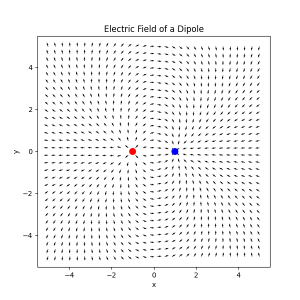
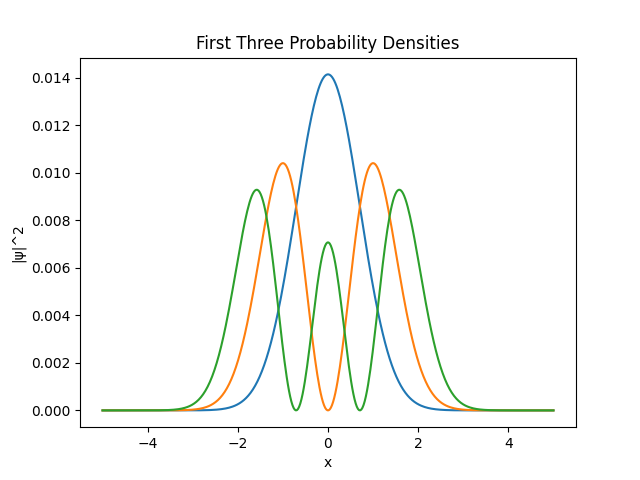

# Python Physics Tasks

This repository contains small Python projects and numerical simulations I built while learning computational physics and scientific programming.

## Projects

### Electric Field Simulation
Simulates electric field distributions for multiple charge configurations using Coulomb's law.

Features:
- Vector field calculation
- Field visualization using Matplotlib
- Adjustable charge positions and magnitudes

Concepts:
- Electrostatics
- Numerical computation
- Scientific visualization

### Quantum Harmonic Oscillator
Numerical solution of the time-independent Schrödinger equation for the quantum harmonic oscillator.

Features:
- Finite difference method
- Matrix diagonalization
- Eigenvalues and eigenfunctions
- Probability density visualization

Concepts:
- Quantum mechanics
- Numerical methods
- Linear algebra

## Example Output

### Electric Field Simulation

### Quantum Harmonic Oscillator

## Tools Used
- Python
- NumPy
- Matplotlib
- LaTeX for documentation

## Author
Pranay Gulati  
B.Sc. (Hons.) Physics — Kirori Mal College
